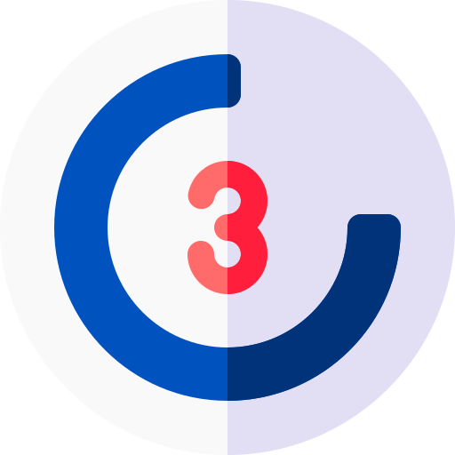
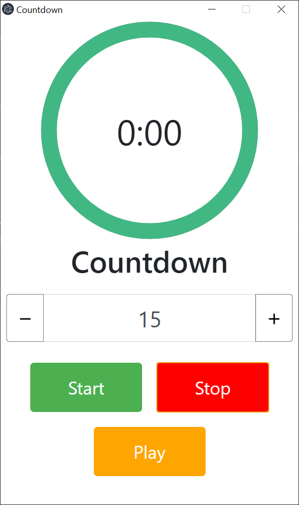

    

<h1 align="center">Electron Countdown</h1>

    
    

    <strong>Download the latest version of <a href="https://github.com/stevenweissheimer/electron-coutdown-tool/releases">Electron Countdown</a>. 
    Visit me on <a href="https://twitter.com/stevenweissheimer">Twitter</a> | <a href="https://www.facebook.com/stevenweissheimer">Facebook</a> | <a href="https://www.facebook.com/stevenweissheimer">Instagram</a></strong>

    

## Available Scripts

In the project directory, you can run:

### `npm run start-electron-dev`

Runs the app in the development mode.\

The page will reload if you make edits.\

### `npm run pack:win64`

Builds the win64 app-package for post production to the `dist` folder.\

### `npm run pack:win32`

Builds the win32 app-package for post production to the `dist` folder.\

### `npm run pack:osx`

Builds the Apple OSx app-package for post production to the `dist` folder.\

## Use the Core Files in Browser

You can use the core of the app in browser too. Use for these the files in the `builds` folder.\

